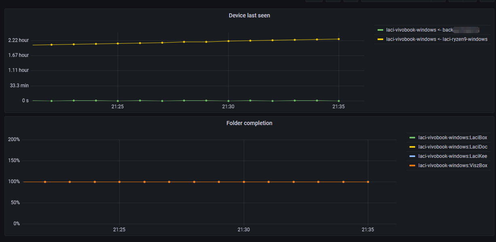

# syncflux

Report statistics from Syncthing instances to influxdb. You can configure multiple syncthing and influxdb instances.

Data points are sent for two different measurements:

1. All registered devices, fields=last_seen_since_sec, tags=id, name
2. All local folders, fields=completion (percent), tags=id, label, path

For all data points, my_id and my_name tags are added (id and name of the reported syncthing instance).

Example use case: you can visualize this with Grafana, and also setup alert rules to notify the 
admins when something goes wrong:

 

## Installation

The recommended way is to use pipenv to create a virtual environment:

    git clone git@github.com:nagylzs/syncflux.git
    cd syncflux
    pipenv install --skip-lock

Since syncflux is a single Python script, you can also install the required packages globally instead. Check `Pipenv`
file for required packages.

## Configuration

Copy `syncflux_example.yml` into `syncflux.yml`, and edit to your needs.

Main configuration sections:

* **syncthings** - named configurations for Syncthing instances
* **influxes** - named configurations for InfluxDb instances
* **measurements** - configure your measurement names here

## Run

You can start syncflux from command line or cron:

  pipenv run python syncflux.py -c syncflux.yml

Use `--help` for command line options.

## Run as a windows service

The easiest way to run syncflux as a service on Windows is to use the [non-sucking service manager](https://nssm.cc/download).

* Download NSSM [from here](https://nssm.cc/download).
* Create a new service with:

    nssm.exe install syncflux
  
* Use the following settings:

  - Application path: point to pipenv.exe (e.g. "C:\Program Files\Python10\python.exe")
  - Startup directory: point to the directory containing syncflux.py and Pipenv
  - Arguments: `run python syncflux.py --count=-1 --silent --config=syncflux.yml` but pleae refer
    to `--help` for all options.
  - Change your display name, description, startup type as desired.
  - If you have used pipenv, then give your credentials on the "Log on" tab.
    Also, you need [to enable "service log on"](https://docs.microsoft.com/en-us/system-center/scsm/enable-service-log-on-sm?view=sc-sm-2019#enable-service-log-on-through-a-local-group-policy) for your user account.
  - Alternatively, if you have installed python and all required packages globally, then
    you can use local system account.
  - On the "Shutdown" tab, leave "Control+C" checked, but uncheck
    all others (WM_CLOSE, WM_QUIT, Terminate process)
  - Carefully check options on "Exit actions" tab. If you choose to use
    "restart application" then you should always set "deplay restart by"
    to a sensible value.
    
